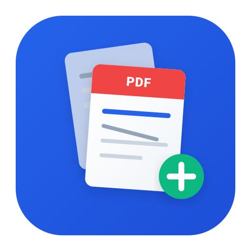

# PDFgood - Client-Side PDF & Image Merger Web App

**PDFgood** คือเว็บแอปพลิเคชันสำหรับรวมไฟล์ PDF และ **แปลงไฟล์รูปภาพเป็น PDF** ที่ประมวลผลฝั่งเบราว์เซอร์ของผู้ใช้ **100% (Client-Side Processing)** ไม่มีการส่งไฟล์หรือข้อมูลใดๆ ออกไปยังเซิร์ฟเวอร์ภายนอก เหมาะสำหรับใช้งานส่วนตัว ปลอดภัยสูงสุด โฮสต์บน **GitHub Pages** ได้ฟรี และรองรับการใช้งานแบบ Offline (PWA)

---

## 🌟 ฟีเจอร์หลัก (Features)

* ** Image to PDF Conversion:** แปลงไฟล์รูปภาพนามสกุล `.jpg`, `.jpeg`, `.png`, `.webp`, `.bmp`, `.gif` เป็นไฟล์ PDF ได้ทันที
* ** Unified Sequence Merging:** สามารถเลือกอัปโหลดทั้งไฟล์ PDF และไฟล์รูปภาพพร้อมกันในรายการเดียว ลากสลับลำดับได้อย่างอิสระ (เช่น PDF ➔ ภาพ ➔ ภาพ ➔ PDF)
* ** Image Thumbnail Preview:** แสดงรูปพรีวิวเล็กๆ พร้อมระบุขนาดพิกเซลของรูปภาพในรายการไฟล์
* **100% Client-Side & Zero Data Transfer:** ไฟล์ PDF และรูปภาพถูกประมวลผลในหน่วยความจำ RAM ของเครื่องผู้ใช้ผ่าน JavaScript ปลอดภัย ข้อมูลไม่รั่วไหล
* **Drag & Drop Upload:** รองรับการลากไฟล์วาง หรือเลือกหลายไฟล์พร้อมกัน
* **Drag to Reorder (SortableJS):** สามารถลากสลับลำดับก่อน-หลังของไฟล์ก่อนทำการรวมได้ง่ายดาย
* **Offline PWA Support:** มี Service Worker และ Web Manifest สามารถติดตั้งลงเครื่อง Desktop/Mobile และเปิดใช้งานแม้อยู่ในสถานะไม่มีอินเทอร์เน็ต
* **Ad-free & Responsive:** หน้าจอสะอาดตา ไม่มีโฆษณา ใช้งานได้สะดวกลื่นไหลทั้งบนคอมพิวเตอร์ แท็บเล็ต และมือถือ

---

## 🛠 เทคโนโลยีที่ใช้ (Tech Stack)

* **HTML5 / HTML5 Canvas / ES6+ JavaScript / CSS (Tailwind CSS)**
* **[pdf-lib](https://pdf-lib.js.org/):** Library ประมวลผลและสร้างไฟล์ PDF ฝั่ง Client-side
* **[SortableJS](https://sortablejs.github.io/Sortable/):** Library สำหรับจัดการ Drag & Drop สลับลำดับใน File List
* **Service Worker:** จัดการ Caching สำหรับการทำงานแบบ Offline (PWA)

---

## 🚀 การทดสอบใช้งานในเครื่อง (Local Setup)

### ผ่าน Laragon / Web Server
เนื่องจากโปรเจกต์นี้ตั้งอยู่ที่ `c:\laragon\www\pdfgood` สามารถเปิดใช้งานได้ดังนี้:
1. เปิด Laragon และกด **Start All**
2. เปิดเบราว์เซอร์แล้วไปที่: `http://localhost/pdfgood`

---

## 📦 การ Deploy ขึ้น GitHub Pages

1. เข้าไปที่ Repository ของคุณบน GitHub
2. อัปโหลดไฟล์ที่อัปเดตใหม่ (`index.html`, `sw.js`, โฟลเดอร์ `js/`) ขึ้น GitHub ผ่านเมนู **Add file > Upload files**
3. กด **Commit changes**
4. ระบบ GitHub Pages จะอัปเดตเว็บออนไลน์ให้ทันทีที่ `https://<YOUR_USERNAME>.github.io/pdfgood/`
